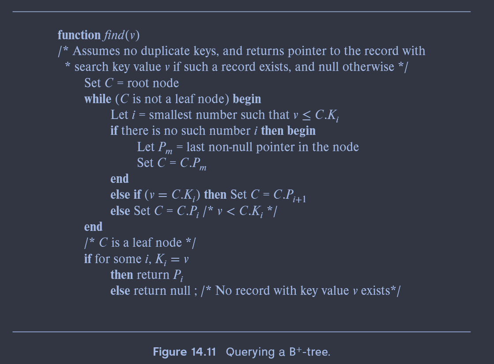
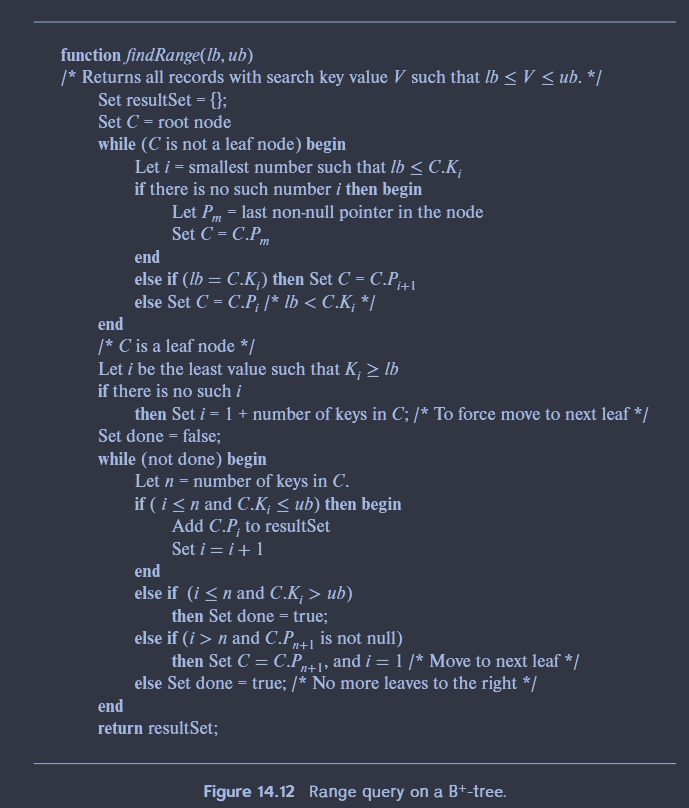
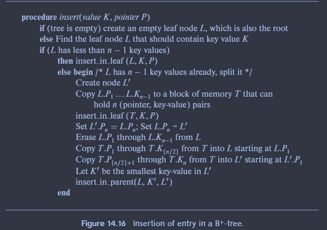
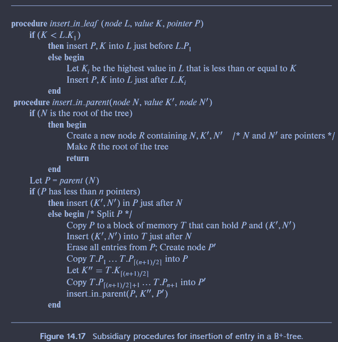
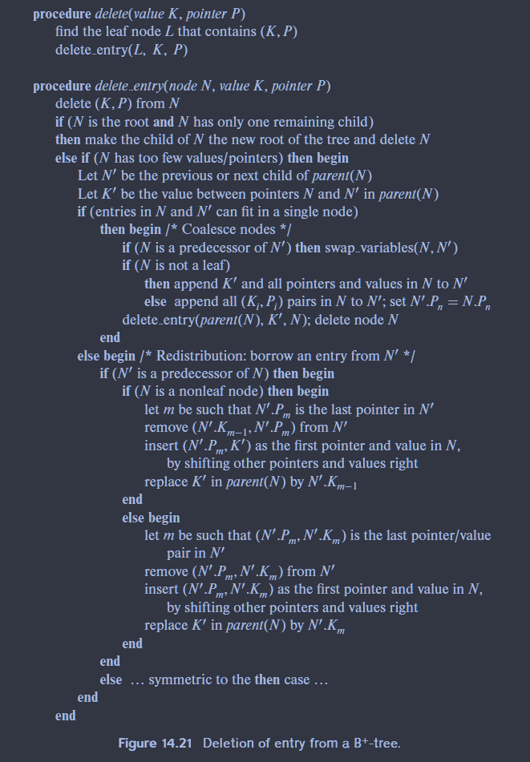

# Lab 2

## 任务

实现并发的 B+Tree Index

## B+ Tree

- 是一个自平衡树。这是一种插入、删除均为 O(log n)的数据结构。可以支持线性遍历（哈希表不能做到）

- 相比 Hash Table，最好的性能是 O(1)，最差时退化到 O(n)。因为平衡，所以任意一个叶子结点到根结点的时间复杂度均为 O(log n)

- 对于读写磁盘上整页数据具有其他数据结构不具备的优势

### B+ Tree Properties

$M$阶搜索树

- $ \frac{M}{2} - 1 \le keys \le M - 1$
- 每个中间结点，$k$个关键字有$k+1$个非空孩子
- 叶子结点存放关键字和数据

### Node

key 继承自索引依赖的属性

value

> inner node 中 value 是下一个节点的指针；leaf node 中是存放数据的地址或者数据本身

所有的 NULL 值要么存放在 first leaf node，要么是 last leaf node

### LeafNode

常见的叶子结点具体实现如图所示：

- 将 key 数组和 values 分开保存而不是放在一起保存，是**因为查询时常需要扫描大量 key，key 的长度固定，有助于 CPU cache hit；**
  > 查询时只需要扫描 key，就不用在缓存里读取 value 的信息。当查询到具体的 key 时，通过 offset 能够直接找到 values 数组中的值。
- leaf node value
  1. Record IDs
     > 存放 tuple 的指针
  2. Tuple Data
     > 直接存放 tuple 的内容

## B+ Tree Operation

### query

### range query

### insert

### delete

