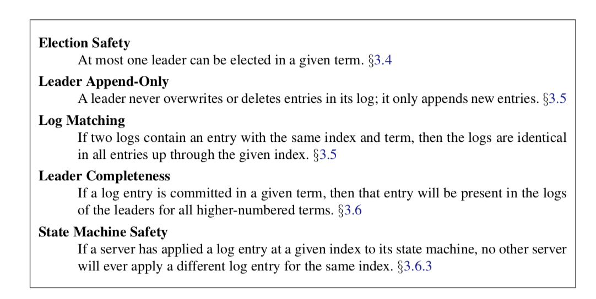

# raft 论文笔记
## raft 解决的问题
通过领导者的方式，Raft 将一致性问题分解成了三个相对独立的子问题：

- 领导者选举：启动集群时以及现有领导者失败时必须选出新的领导者。
- 日志复制：领导者必须接受来自客户端的日志条目，并在整个集群中复制它们，迫使其他日志与其自己的日志一致。
- 安全性：Raft 的安全属性的关键是图 3.2 中的状态机安全性属性：如果任何服务器已将特定的日志条目应用于其状态机，则其他服务器都不可以对同一日志索引应用不同的命令。第 3.6 节介绍了 Raft 如何确保此属性；这个解决方案涉及对第 3.4 节中所述的选举机制的额外限制。

  

## raft 领导者选举问题
这里可能出现无限选举瓜分的情况
```admonish warning
第三种可能的结果是候选人既没有赢得选举也没有输：如果有多个跟随者同时成为候选人，那么选票可能会被瓜分以至于没有候选人可以赢得大多数人的支持。当这种情况发生的时候，每一个候选人都会超时，然后通过增加当前任期号来开始一轮新的选举。然而，没有其他机制的话，选票可能会被无限的重复瓜分
```
- 这里使用随机选举超时时间来确保选票瓜分情况出现频率较低
  
```admonish example
选举超时时间是从一个固定的区间（例如 150-300 毫秒）随机选择。这样可以把服务器都分散开以至于在大多数情况下只有一个服务器会选举超时；然后他赢得选举并在其他服务器超时之前发送心跳包。同样的机制被用在选票瓜分的情况下。每一个候选人在开始一次选举的时候会重置一个随机的选举超时时间，然后在超时时间内等待投票的结果；这样减少了在新的选举中另外的选票瓜分的可能性。
```
## raft 日志复制

- 领导者针对每一个跟随者维护了一个 nextIndex，这表示下一个需要发送给跟随者的日志条目的索引地址。当一个领导者刚获得权力的时候，他初始化所有的 nextIndex 值为自己的最后一条日志的 index 加 1。
  > 如果一个跟随者的日志和领导者不一致，那么在下一次的附加日志 RPC 时的一致性检查就会失败。在被跟随者拒绝之后，领导者就会减小 nextIndex 值并进行重试。最终 nextIndex 会在某个位置使得领导者和跟随者的日志达成一致。当这种情况发生，附加日志 RPC 就会成功，这时就会把跟随者冲突的日志条目全部删除并且加上领导者的日志。一旦附加日志 RPC 成功，那么跟随者的日志就会和领导者保持一致，并且在接下来的任期里一直继续保持。
  > 优化1：在领导者发现它与跟随者的日志匹配位置之前，领导者可以发送不带任何条目（例如心跳）的附加日志 RPCs 以节省带宽。 然后，一旦 matchIndex 恰好比 nextIndex 小 1，则领导者应开始发送实际条目。
  > 优化2：算法可以通过减少被拒绝的附加日志 RPCs 的次数来优化。例如，当附加日志 RPC 的请求被拒绝的时候，跟随者可以包含冲突的条目的任期号和自己存储的那个任期的最早的索引地址。

## raft 安全性
### 选举限制
- 日志条目的传送是单向的，只从领导者传给跟随者，并且领导者从不会覆盖自身本地日志中已经存在的条目。
- 请求投票 RPC 实现了这样的限制： RPC 中包含了候选人的日志信息，然后投票人会拒绝掉那些日志没有自己新的投票请求。
```admonish info
日志“新”的定义：Raft 通过比较两份日志中最后一条日志条目的索引值和任期号定义谁的日志比较新。如果两份日志最后的条目的任期号不同，那么任期号大的日志更加新。如果两份日志最后的条目任期号相同，那么日志比较长的那个就更加新。
```
- Raft 永远不会通过计算副本数目的方式去提交一个之前任期内的日志条目。只有领导者当前任期里的日志条目通过计算副本数目可以被提交；一旦当前任期的日志条目以这种方式被提交，那么由于日志匹配特性，之前的日志条目也都会被间接的提交。


```admonish info
在 (a) 中，S1 是领导者，部分的复制了索引位置 2 的日志条目。在 (b) 中，S1 崩溃了，然后 S5 在任期 3 里通过 S3、S4 和自己的选票赢得选举，然后从客户端接收了一0000000条不一样的日志条目放在了索引 2 处。然后到 (c)，S5 又崩溃了；S1 重新启动，选举成功，开始复制日志。在这时，来自任期 2 的那条日志已经被复制到了集群中的大多数机器上，但是还没有被提交。如果 S1 在 (d1) 中又崩溃了，S5 可以重新被选举成功（通过来自 S2，S3 和 S4 的选票），然后覆盖了他们在索引 2 处的日志。反之，如果在崩溃之前，S1 把自己主导的新任期里产生的日志条目复制到了大多数机器上，就如 (d2) 中那样，那么在后面任期里面这些新的日志条目就会被提交（因为 S5 就不可能选举成功）。 这样在同一时刻就同时保证了，之前的所有老的日志条目就会被提交。
```

## 故障情况处理
### follower 和 candidate 崩溃
- Raft 中处理这种失败就是简单的通过无限的重试；如果崩溃的机器重启了，那么这些 RPC 就会完整的成功。如果一个服务器在完成了一个 RPC，但是还没有响应的时候崩溃了，那么在他重新启动之后就会再次收到同样的请求。
- **Raft 的 RPCs 都是幂等的，所以这样重试不会造成任何问题。**

### 持久化状态和服务重启
- 每一个服务器需要持久化当前的任期和投票选择
  > 以防止服务器在相同的任期内投票两次，或者将新领导者的日志条目替换为废弃领导者的日志条目。
- 每一个服务器也要在统计日志提交状态之前持久化该日志
  > 这可以防止已经提交的条目在服务器重启时丢失或“未提交”。


