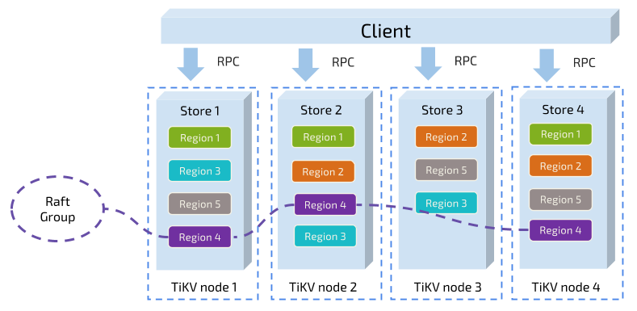

# raft kv server 设计

```admonish info
这里的设计均是来自于 pingcap 公司的 Tinykv项目
```

## 总体设计



## 术语

- Store: 每个节点叫做 Store
- RaftStore: 位于 Store 中，每个 Store 一个 RaftStore，用于监听用户的事件并与下层的 raft 层进行交互，同时需要与同一 Raft Group 的 peer 相互通信
- Peer: 每个 Raft 中的 leader/candidate/follower，每个 RaftStore 中包含多个 peer，每个 peer 是来自不同的 Raft Group，所有的 peer 共用同一个底层存储
- Region: 一个 Region 叫做一个 Raft Group，一个 region 包含多个 peer，这些 peer 散落在不同的 RaftStore 上。Region 处理的是某一个范围的数据。比如 Region A 处理 $0 \le key \le split$，Region B 处理 $split \leq key \le MAX$，两个 Region 各司其职，互不干涉，均有自己的 Leader。

## 层次架构

- Raft 层: Rawnode-Raft-RaftLog 统称为 raft 层，raft 层收到 peer 层传来的 entry 后，会在集群内部进行同步
- peer 层: 实际上是 RaftStore 的部分模块，接收来自 client 的 RaftCmdRequest，其中包含着不同的命令请求，接着它会把这些请求逐一以 entry 的形式传递给 raft 层，当然，这个 peer 应该是 Leader，不然 client 会找下一个 peer 继续试。同时，peer 会向 raft 请求 Ready 结构体，对已经同步的数据进行持久化
- client 层: 向 RaftKV 发出请求
  

## 用户的操作

1: "Get": 获取 key 对应的 value
3: "Put": 插入 key-value 对
4: "Delete": 根据 key 删除 key-value 对
5: "Snap": 为当前状态生成快照？

## 工作流程

1. RaftStore 在节点启动被创建，它负责维护在该节点上所有的 region 和对应的 peer
   ```go
   type Raftstore struct {
    ctx        *GlobalContext
    storeState *storeState
    router     *router  // 路由的作用，在这里维护<region id, peer>对应关系
    workers    *workers // 可以看作是线程池，都是处理用户传来的消息
    tickDriver *tickDriver
    closeCh    chan struct{}
    wg         *sync.WaitGroup
   }
   ```
1. 接着，RaftStore 会加载 peers，然后将 peers 注册进 router。加载 peer 的时候如果底层存储着之前 peer 信息，那么根据存储的信息加载，否则就新建。
1. 启动一系列的 worker。RaftStore 的主要工作你可以认为就是接收来自其他节点的 msg，然后根据 msg 里面的 region id 将其路由到指定 region 的 peer 上。同时 RaftStore 也会将 peer 获取需要发送给其他节点的信息，发到其他的 RaftStore 上。

### RaftWorker 工作流程

- 不停的处理收到的 msg，然后根据 RawNode 传来的 ready 持久化当前 peer 的状态
- `HandleMsg` 是一个 switch，根据 msg 的类型进行不同的处理
- `HandleRaftReady`处理 RawNode 产生的 Ready

```go
// run runs raft commands.
// On each loop, raft commands are batched by channel buffer.
// After commands are handled, we collect apply messages by peers, make a applyBatch, send it to apply channel.
func (rw *raftWorker) run(closeCh <-chan struct{}, wg *sync.WaitGroup) {
	defer wg.Done()
	var msgs []message.Msg
	for {
		msgs = msgs[:0]
		select {
		case <-closeCh:
			return
		case msg := <-rw.raftCh:
			msgs = append(msgs, msg)
		}
		pending := len(rw.raftCh)
		for i := 0; i < pending; i++ {
			msgs = append(msgs, <-rw.raftCh)
		}
		peerStateMap := make(map[uint64]*peerState)
		for _, msg := range msgs {
			peerState := rw.getPeerState(peerStateMap, msg.RegionID)
			if peerState == nil {
				continue
			}
			newPeerMsgHandler(peerState.peer, rw.ctx).HandleMsg(msg)
		}
		for _, peerState := range peerStateMap {
			newPeerMsgHandler(peerState.peer, rw.ctx).HandleRaftReady()
		}
	}
}
```

### HandleRaftReady 工作流程

1. 判断是否有新的 Ready，没有就什么都不处理
2. 调用 SaveReadyState 将 Ready 中需要持久化的内容保存到 KV 数据库。如果 Ready 中存在 snapshot，则处理它
3. 调用 Send 将 Ready 中的 Msg 发出去
4. 应用 Ready 中的 CommittedEntries
   > 最后调用 proposal 进行回复处理
5. 调用 Advance 推进 Raft 层的同步过程

### Proposal 回复处理

- 需要考虑过时的 entry，落后的 leader 等边界情况

```c++
for len(d.proposals) > 0 {
	proposal := d.proposals[0]
	if entry.Term < proposal.term {
		return
	}

	if entry.Term > proposal.term {
		proposal.cb.Done(ErrRespStaleCommand(proposal.term))
		d.proposals = d.proposals[1:]
		continue
	}

	if entry.Term == proposal.term && entry.Index < proposal.index {
		return
	}

	if entry.Term == proposal.term && entry.Index > proposal.index {
		proposal.cb.Done(ErrRespStaleCommand(proposal.term))
		d.proposals = d.proposals[1:]
		continue
	}

	if entry.Index == proposal.index && entry.Term == proposal.term {
		if resp.Header == nil {
			resp.Header = &raft_cmdpb.RaftResponseHeader{}
		}
		if isExecSnap {
			proposal.cb.Txn = d.peerStorage.Engines.Kv.NewTransaction(false) // 注意时序，一定要在 Done 之前完成
		}
		// proposal.cb.Txn = txn
		proposal.cb.Done(resp)
		d.proposals = d.proposals[1:]
		return
	}

	panic("This should not happen.")
}
```

## snap 工作流程

- 在 `d.onRaftGCLogTick()` 中通过检查 `appliedIdx - firstIdx >= d.ctx.cfg.RaftLogGcCountLimit` 来决定是否进行日志删除。如果是，那么就通过 proposeRaftCommand() 提交一个 `AdminCmdType_CompactLog` 下去，当该 Request 被集群同步完成并在 HandleRaftReady 中执行时，会被交给 raftlog_gc.go 来实现删除。
- 删除完日志后，节点会更新自己的 `applyState.TruncatedState.Index`，该字段指已经被删除的最后一条日志，即该日志之后均没有被删除。

### snap 的生成

- 因为 Snapshot 很大，不会马上生成，这里为了避免阻塞，生成操作设为异步，如果 Snapshot 还没有生成好，Snapshot 会先返回 raft.ErrSnapshotTemporarilyUnavailable 错误，Leader 就应该放弃本次 Snapshot，等待下一次再次请求 Snapshot。
